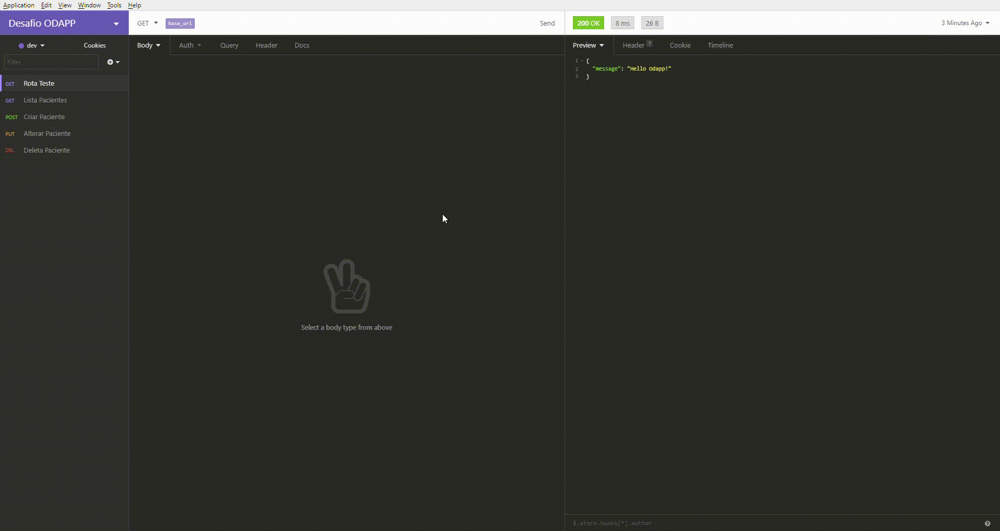
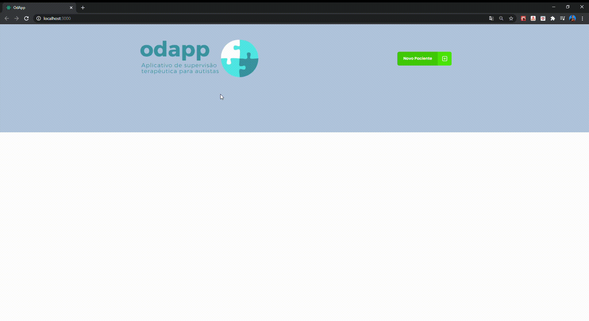
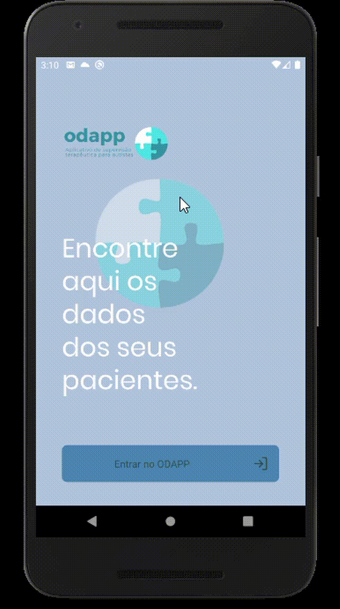

<h1 align="center">
    
</h1>

<h1 align="center"> 
    odapp-challenge
</h1>

# Índice

- [Sobre](#sobre)
- [Tecnologias Utilizadas](#tecnologias-utilizadas)
- [Como Usar](#como-usar)
- [Testes](#testes)

## :bookmark: Sobre 

Desafio de criar um sistema simples que auxilie as pessoas a localizarem dados de pacientes em suas tarefas diárias.

## :rocket: Tecnologias Utilizadas

- Yarn v1.19.0
- Docker v19.03.8
- NodeJS v12.16.2;
- TypeScript;
- TypeORM;
- Express;
- Banco de dados: MongoDB;
- Testes unitários: jest;
- React
- React Native

## :computer: Resultado no Insomnia

<h1 align="center">
    
</h1>

## :computer: Resultado no Web

<h1 align="center">
    
</h1>

## :mobile: Resultado no Mobile

<h1 align="center">
    
</h1>

## :fire: Como usar

- Clone esse repositório: `git clone https://github.com/diogobarreiros/odapp-clinic-challenge.git`
- Acesse a pasta `cd backend`
- Instale as dependências: `yarn install`
- Crie o banco de dados: `docker run --name mongodb -p 27017:27017 -d -t mongo`
- Inicie o banco de dados: `docker start mongodb`
- Inicie a api em ambiente de desenvolvimento: `yarn dev:server`
- Acesse a api pela seguinte URL: `http://localhost:3333`
- Para consultar todos os pacientes utilize a rota: `http://localhost:3333/pacientes`

- Acesse a pasta `cd frontend`
- Instale as dependências: `yarn install`
- Inicie a aplicação: `yarn start`

- Acesse a pasta `cd mobile`
- Instale as dependências: `yarn install`
- Inicie a aplicação no android: `yarn android`
- Inicie a aplicação no ios: `yarn ios`

## :heavy_check_mark: Testes

- Para rodar os testes unitários rode o seguinte comando: `yarn test`

---

<h4 align="center">
    Feito por <a href="https://www.linkedin.com/in/diogo-barreiros-b2a96836/" target="_blank">Diogo Barreiros</a>
</h4>